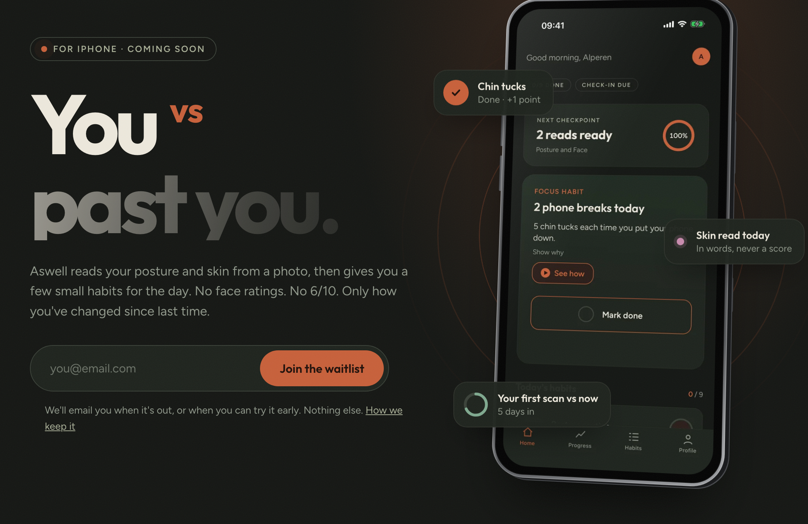
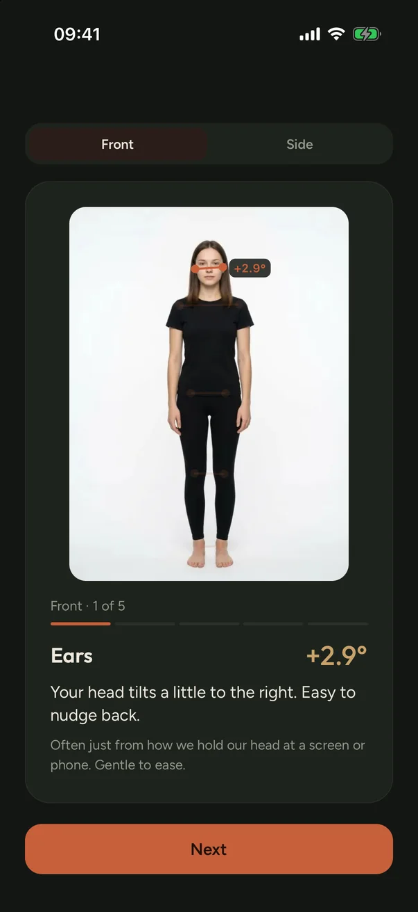
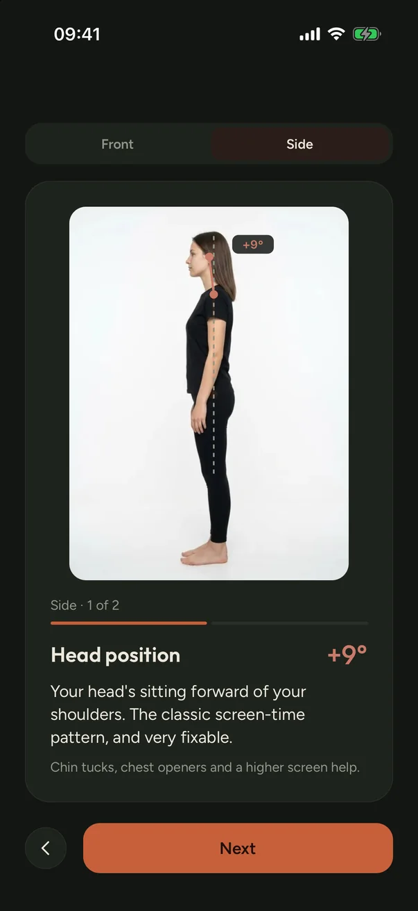
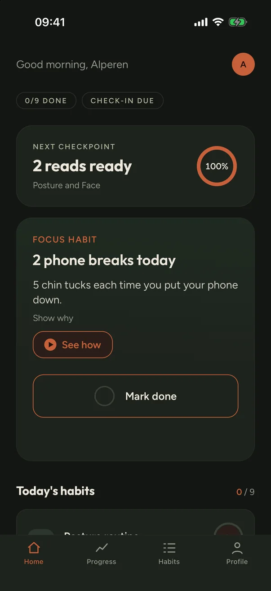
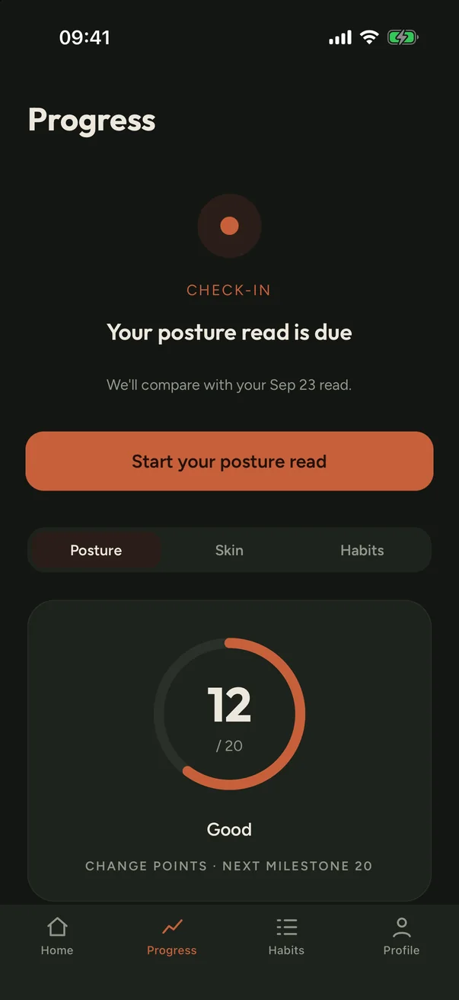
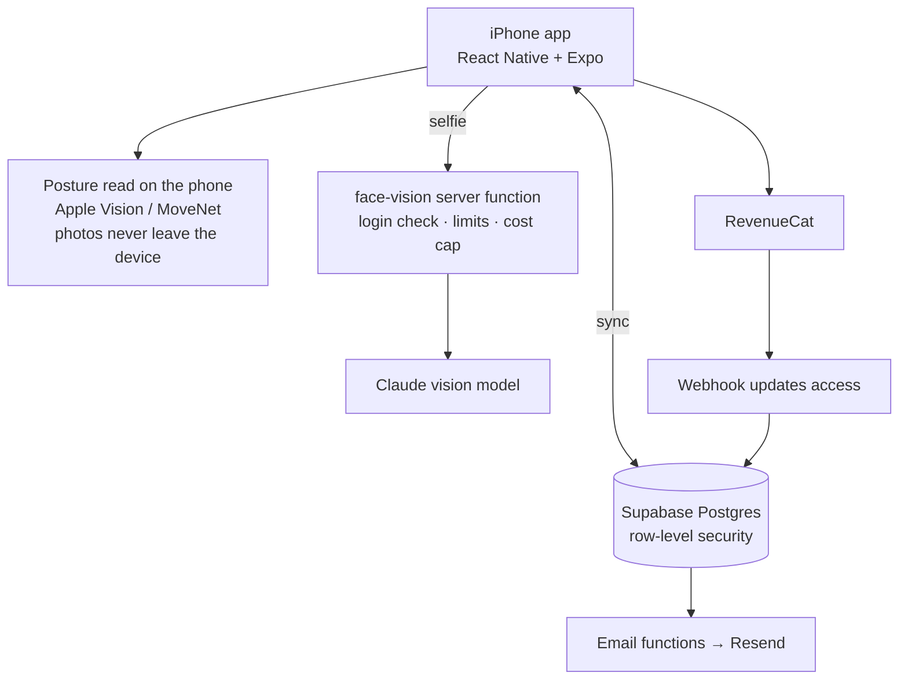

  

<h1 align="center">Aswell</h1>

  <b>An honest self-care app for posture and skin. No face ratings, no 6/10. Just you vs past you.</b> 
  iOS app · built this summer as a second-year student · <a href="https://aswell.app">aswell.app</a>

**▶ [Watch the 2-minute demo](https://youtu.be/X9aKIC8NYsE)**: a full run from onboarding to the daily plan, recorded in the iOS Simulator.

> **Why is the code private?** Aswell is a real product on its way to the App Store, so the full source stays private. This repo shows what I built, how it works, and a few parts of the code I'd show.

---

## Why I built it

My feed was full of looksmaxxing apps. You upload a selfie, you get a 6.4 out of 10, then a paywall to "fix" yourself. That number is made up, and it makes people feel worse.

I wanted to build the honest version. Only posture and skin, the things you can actually change. You scan, you get a small daily plan, and a week later you scan again to see what moved. The only person you're compared to is you from last week.

## What it does

- **Posture read.** A front and a side photo. The app finds your joints on the phone and measures angles like head tilt, forward head and shoulder level, then explains them in plain words.
- **Skin read.** A selfie. An AI model sorts what it can see (redness, dryness, breakouts). It never judges your looks and never gives a score.
- **Daily plan.** Up to 5 small habits based on what the reads found, with guided exercise videos.
- **Check-ins.** Every 7 days you scan again and see a before/after against your own earlier scans.
- **The rest of a real product.** Accounts, sync, subscriptions, reminders, emails, a landing page and a waitlist.

  
  
  
  

## Tech stack

| Part | What I used |
|---|---|
| App | React Native, Expo (SDK 56), TypeScript, expo-router, Zustand |
| Posture detection | Apple Vision through my own native Swift module, TensorFlow MoveNet as a fallback |
| Skin read | A vision AI model (Claude), called only from my own server function |
| Backend | Supabase: Postgres, auth (email code + Sign in with Apple), 9 edge functions, row-level security on every table |
| Payments | RevenueCat, with a webhook that updates the user's access on the server |
| Email | Resend (welcome and reminder emails, one-click unsubscribe) |
| Monitoring | Sentry for crashes, PostHog for product analytics, both EU-hosted with no personal data |
| Shipping | EAS builds, TestFlight, landing page on Cloudflare Pages |
| Testing | Node's built-in test runner, 406 automated tests |

## How it fits together

## Engineering decisions I'm proud of

**1. Posture runs fully on the phone.**
I added a native Swift module so the app can use Apple's own body tracking, and kept MoveNet as a fallback. Before choosing, I ran both engines on the same real photos. MoveNet put one person's hips at their shirt hem, which would have shown a fake hip tilt. Vision got it right. Posture photos never leave the device, and a posture read costs nothing to run.
→ [`samples/VisionPoseModule.swift`](samples/VisionPoseModule.swift)

**2. If I can't measure it honestly, I don't show it.**
A joint the model only guessed doesn't get an angle. The app also checks that the legs make physical sense before measuring hips, knees and ankles. I dropped pelvic tilt and knee alignment completely, because one 2D photo can't measure them properly.
→ [`samples/postureMath.ts`](samples/postureMath.ts)

**3. The AI endpoint can't be abused.**
The API key lives only on the server. Every face read goes through one purpose-built function: login check, hourly rate limit, weekly limit, a global daily cost cap, and a free-scan check. That check first had a race condition: two requests fired at the same moment could both use the same free scan. I fixed it with a single conditional database update, so only one request can win. If the read fails, the free scan is given back.
→ [`samples/face-vision.ts`](samples/face-vision.ts)

**4. Never compare scans read by different engines.**
Two pose engines place joints slightly differently, so switching engines could look like your body changed. One small function decides which scans can be compared, and every before/after, points total and share card goes through it.
→ [`samples/comparableScans.ts`](samples/comparableScans.ts)

**5. Privacy-first analytics.**
Every analytics event passes through a tested filter that drops anything that looks like personal data (emails, names, long numbers, free text). The app never links analytics to a user.
→ [`samples/sanitizeProps.ts`](samples/sanitizeProps.ts)

**6. I measured the cost before picking a price.**
One paying user costs about $0.40 a month to serve, and a free user costs about 1.5 cents, once. That's why the free version can stay generous.

## Bugs that taught me the most

- **The fix was going to the wrong place.** I hardened the AI endpoint, but the app was still calling an older copy of it with a different URL. Unit tests couldn't catch that. Only testing the real app end to end did. Lesson: check the exact URL the app calls, not the name shown in a dashboard.
- **Free scans never got used up.** The model sometimes wraps its JSON in a code block. The server didn't expect that, so every real read looked like a failed one and the free scan was refunded every time.
- **Apple Vision doesn't run in the iOS Simulator.** Its body-pose model is missing there. So I wrote a small script that runs both engines on my Mac on the same photos, and compared them there.

## How I worked

- Every change went through a branch and a pull request: 200+ merged PRs and 790+ commits since June 2026.
- Bigger features started as a written spec in GitHub Issues, then got split into small tickets.
- I built it with an AI coding partner (Claude Code). I owned the product decisions, the specs, testing and reviewing every change.

## Status

Payments, emails, legal pages, the landing page and the waitlist are live. The TestFlight beta is next. iPhone only for v1.

## Contact

- Website: [aswell.app](https://aswell.app)
- Demo video: [youtu.be/X9aKIC8NYsE](https://youtu.be/X9aKIC8NYsE)
- LinkedIn: [Alperen Sirli](https://www.linkedin.com/in/alperen-sirli/)
- GitHub: [@visionas9](https://github.com/visionas9)

---

The code in `samples/` is shared for portfolio review only. © 2026 Alperen Sirli. All rights reserved.
